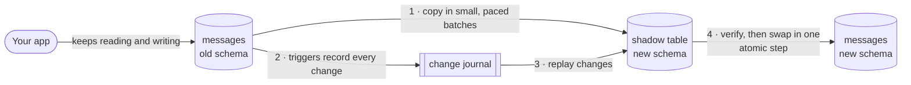
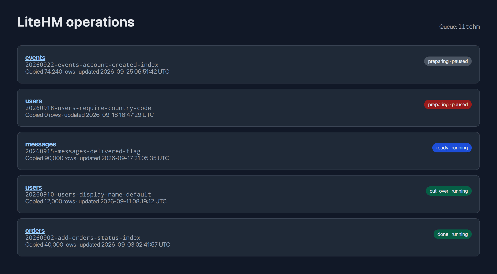

#  LiteHM

[](https://github.com/SebastianSzturo/litehm/actions/workflows/ci.yml)
[](./LICENSE)

**Online schema changes for big SQLite tables, without blocking your app.**
LiteHM is the Large Hadron Migrator for SQLite, in the spirit of
[Shopify's LHM](https://github.com/Shopify/lhm) and SoundCloud's
[original LHM](https://github.com/soundcloud/lhm).

## Who it's for

You run SQLite in production with Rails, your tables have grown large, and
migrations have become a problem: adding an index or a column locks the
database for minutes, every write waits, and deploys stall. LiteHM makes those
changes while your app keeps reading and writing.

If your tables are small, plain Rails migrations are simpler. Use them.

## How it works

SQLite has one writer at a time. A normal `add_index` or table rebuild takes
that writer slot for the whole operation, so a big table means a long outage.

LiteHM is like moving house while still living in it. It builds a copy of the
table with the new shape, moves rows over a few at a time, writes down every
change you make in the meantime, and swaps the new table in at the end in one
instant step.



- **Your writes come first.** Each batch holds the writer slot for about 10 ms,
  then pauses so application writes get through.
- **Nothing is lost.** Every change made during the copy is recorded and
  replayed, and the result is checked row for row before the swap.
- **Crashes are fine.** Progress lives in the database, so a killed or
  redeployed worker picks up where it left off.
- **Deploys stay fast.** The migration only schedules the work; a background
  job does the copying.
- **It refuses rather than guesses.** A change LiteHM can't prove safe fails
  before anything is touched.

## Quick start

Requirements: Ruby 3.3+, Rails 8.1+, and sqlite3-ruby 2.9.6+ with SQLite
3.51.3+ in WAL mode, in **every** process that writes the database. The
precompiled `sqlite3` gems bundle a suitable SQLite.

```ruby
# Gemfile
gem "litehm"
```

```ruby
# config/initializers/litehm.rb
LiteHM.configure do |config|
  config.queue_name = :litehm
  config.connection = -> { ActiveRecord::Base.connection }
  config.base_controller_class = "AdminController"
  config.authorize_with { |controller| controller.current_user&.admin? }
end

# config/routes.rb
mount LiteHM::Engine => "/admin/litehm"
```

Write migrations with `LiteHM.change_table`:

```ruby
class AddMessageDeliveryLookup < ActiveRecord::Migration[8.1]
  disable_ddl_transaction!

  def up
    LiteHM.change_table(:messages, id: "20260818-message-delivery",
      connection: connection) do |table|
      table.add_column :delivered, :boolean, null: false, default: false
      table.add_index %i[delivered sent_at], name: :messages_delivery
    end
  end

  def down
    LiteHM.revert("20260818-message-delivery", connection: connection)
  end
end
```

Then run a worker for the `litehm` queue. With Solid Queue:

```yaml
# config/queue.yml
production:
  workers:
    - queues: litehm
      threads: 1
      processes: 1
```

```yaml
# config/recurring.yml: re-enqueues work whose worker was killed
production:
  litehm_recovery:
    class: LiteHM::RecoveryJob
    queue: litehm
    schedule: every 5 minutes
```

Any Active Job backend that redelivers interrupted jobs works. Keep wildcard
(`"*"`) workers off the `litehm` queue.

## Rolling out a change

The migration returns as soon as the work is scheduled, before the new schema
exists. Roll out in three steps:

1. Deploy code that works with the old schema, together with the migration.
2. Wait until the dashboard shows the operation has cut over.
3. Deploy code that uses the new column or index.

Always pass an explicit `id`. Re-running the same id resumes the same plan.
Use `up`/`down` rather than `change`, with `down` calling `LiteHM.revert`.

## Dashboard

The mounted engine lists every operation with its progress and lets you pause,
resume, abort, retry, or cut over
([operation detail](./docs/images/dashboard-operation.png)).



## What LiteHM won't do

LiteHM changes **one table at a time** and refuses, before touching anything:

- SQLite older than 3.51.3, or a database not in WAL mode
- tables without a primary key or `UNIQUE NOT NULL` column
- non-deterministic or multi-row projections (subqueries, aggregates, `now`)
- triggers on other tables that reference the migrating table
- changes to keys that other tables' foreign keys point at
- foreign keys whose child column has no index

Throughput is also bounded on purpose. If your app writes faster than LiteHM's
paced batches can catch up, the operation waits and eventually stops safely
instead of slowing your app. The full list and the reasons are in
[docs/safety.md](./docs/safety.md).

## Does it hold up?

On a restored multi-gigabyte production database, adding a `NOT NULL` column
took 26 minutes. The worker was killed with `SIGKILL` partway through and
resumed. Under continuous concurrent writes there were zero writer errors and
a 10.7 ms write p99. See the
[writer-latency rehearsal](./docs/writer-latency-rehearsal.md) for the method
and numbers.

Always rehearse on a restored copy of your production database, with a
realistic write load, before running LiteHM on a large table.

## Documentation

- [Operating LiteHM](./docs/operations.md): worker queue, crash recovery,
  pause/abort/cutover/revert, and telemetry events
- [Safety boundary and internals](./docs/safety.md): what is refused and why,
  foreign keys, and raw SQLite DDL targets
- [Design contract](./docs/design-contract.md): the full design and reasoning
- [Writer-latency rehearsal](./docs/writer-latency-rehearsal.md): measured
  latency under load

## Development

```bash
bundle install
bundle exec rake                # full suite, including crash and concurrency tests
bundle exec rake compatibility  # every Gemfile in gemfiles/
```

See [CONTRIBUTING.md](./CONTRIBUTING.md) before opening a pull request, and
[SECURITY.md](./SECURITY.md) to report data-loss bugs privately.

## License

[BSD 3-Clause](./LICENSE), the same license as Shopify's LHM.
